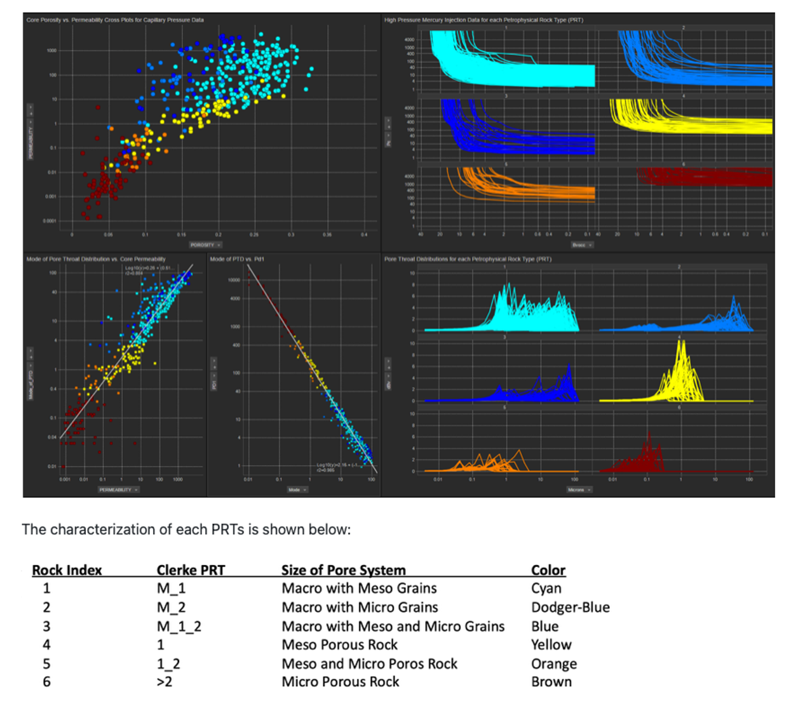
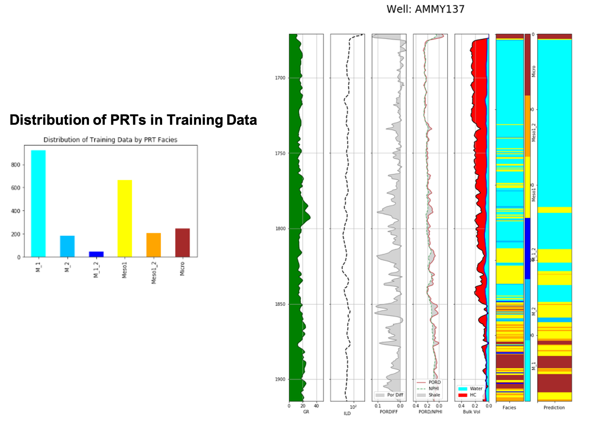

# Petrophysical Rock Type (PRT) Estimations for an Arab D complex carbonate reservoir.

This Notebook started with with the work from Brendon Hall, [Enthought](https://www.enthought.com/)(1)

The dataset we includes log data from eight carbonate wells that have been labeled with Petrophysical Rock Types (PRT) called facies in this instance based on Ed Clerke's Rosetta Stone Arab D carbonate calibration data(2).  We will use the log data to train a support vector machine (SVM) to classify these PRT facies types.  Support vector machines (or SVMs) are a type of supervised learning model that can be trained on data to perform classification and regression tasks.  The SVM algorithm uses the training data to fit an optimal hyperplane between the different classes (or facies, in our case).  We will use the SVM implementation in [scikit-learn](http://scikit-learn.org/stable/modules/svm.html). 

The following is Ed Clerke's Rosetta Stone calibration data which also includes High Pressure Mercury Injection data that were fit to a Thomeer hyperbola with all of the Thomeer Capillary Pressure parameters. 

As mentioned above, we are employing python’s Sklearn as published by Hall(1) to estimate our PRTs. We could have estimated Depositions of Environment or other types of categoric geologic facies used in this Sklearn prediction process, but PRTs are our objective for this notebook. 

The initial process is in the evaluation of the data. Seaborn is used to create the matrix cross plots and histograms. Throughout the process we generate numerous Confusion Matrix type matrix plots, and the Heat Map at the bottom right is used to select the optimum C and gamma values to tune our models for the highest accuracy for our predictions from our data. 

### Evaluate the data with Seaborn Matrix, Confusion Matrix plots and select optimum model values for C and gamma from Heat map:

In the plot below we show a histograms of all of the PRTs, and to better understand the quality of our estimations we have left out the AMMY137 well from our training set to be used as a blind test as shown below. the color bar on the left are the PRT facies from this well and the color bar on the right are our predictions.

### The following are our blind test results:
 

1.	Hall, Brendon, “Facies classification using Machine Learning”, The Leading Edge, 2016, Volume 35, Issue 10
2.	Clerke, E. A., Mueller III, H. W., Phillips, E. C., Eyvazzadeh, R. Y., Jones, D. H., Ramamoorthy, R., Srivastava, A., (2008) “Application of Thomeer Hyperbolas to decode the pore systems, facies and reservoir properties of the Upper Jurassic Arab D Limestone, Ghawar field, Saudi Arabia: A Rosetta Stone approach”, GeoArabia, Vol. 13, No. 4, p. 113-160, October, 2008. 
