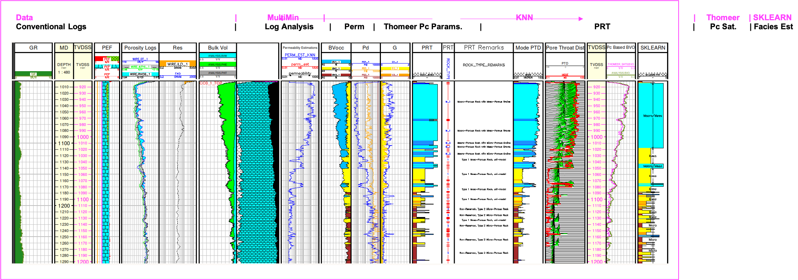

# Geolog used to automate the characterization workflow using Clerke’s carbonate Arab D Rosetta Stone calibration data to provide for a full pore system characterization and model saturations for a typical Arab D complex carbonate reservoir.

Geolog has always been found to be a user-friendly Petrophysical software tool that allows us to load, interrogate, process and display well log and production data. With the introduction of Geolog18, we can now also use python code in the form of Geolog loglans to push the data even further.  Geolog python loglans can exploit state-of-the-art techniques in python to interrogate and build probabilistic methods to estimate additional well log curves, core analysis results, rock types, facies, engineering parameters and model petrophysical properties. 

In this repository we include a full Geolog project with Geolog python loglans, data and one well to utilize a proven workflow to interrogate and characterize a typical Arab D carbonate reservoir interval in the well. This example will serve as the basis for the full-field reservoir characterization for all wells throughout the entire field. In this example we are showing the results for just one well, but in the full-field reservoir characterization we would follow the same workflow and generate the same results for all wells in the field. Our final objective is to use these well data results and create a 3D static model of porosity, permeability, Petrophysical Rock Types (PRT), capillary pressure parameters and saturations that could then go on to simulation. 

This project demonstrates tried and proven techniques as described by Phillips1 et al. used in the characterization of most Arab D reservoirs in Saudi Arabia. Permeability, Petrophysical Rock Types (PRT), Capillary Pressure and modeled saturations are all estimated or calculated in order to characterize this complex carbonate reservoirs, and Clerke’s2 Arab D Rosetta Stone core analysis database is used as the calibration data. 

These calibration data are from Ed Clerke’s Rosetta Stone, Arab-D carbonate dataset from Ghawar field in Saudi Arabia. This is a very special carbonate dataset. Clerke randomly selected the nearly final calibration data from 1,000’s of core plugs for the final data set, and these Rosetta Stone data cover the full range in poro-perm space and Petrophysical Rock Types (PRTs) observed in the Arab D reservoir. For each sample Clerke acquired High Pressure Mercury Injection (HPMI)  and fit the capillary pressure curves using a Thomeer hyperbola (see Altair Plot of Capillary Pressure curves) created from the Initial Displacement Pressure (Pdi), curvature term Gi that relates to the variability of pore throats and Bulk Volume Occupied (BVocci) that is related to the Pore Volume of each pore system i.  For this Arab D reservoir, most rock types have a dual-porosity system, and some rock types have up to 3 pore systems. 

### Suggested Arab D Carbonate Workflow:
The following workflow and processing is suggested to interrogate, process, interpret and model the petrophysical properties of a typical Arab D carbonate reservoir using Clerke’s Arab D Rosetta Stone Carbonate database as calibration. The workflow consists of the following steps:

1) Interrogate the Well Log data and Rosetta Stone calibration data using standard Geolog layouts, cross plots and histograms and then use a python loglan featuring Altair, which is interactive software driven from a Geolog Module Launcher.

##### Altair Used to Interrogate the Well log data in Geolog:

##### Altair used to Interrogate the Rosetta Stone Thomeer Capillary Pressure curves and Petrophysical Rock Types (PRTs):

2) Run MultiMin for a solid log analysis model using the typical minerals found in the Arab D reservoir; Limestone, Dolomite, Anhydrite and Illite.

3) Use available core data from representative reservoir/field to build a petrophysical model to estimate permeability for all wells in field using kNN with normalized input data and weighted by Euclidean distances for each of the nearest neighbors. In this instance our python version of kNN is driven from a Geolog python loglan from our log analysis results.

4) Using the kNN estimated permeability and calculated Total Porosity from MultiMin, we query Clerke’s Rosetta Stone core database to predict the following Petrophysical results:
    - Petrophysical Rock Types (PRT) as defined by Clerke (M_1 Macro/Meso, M_2 Macro/Micro, M_1_2 Macro/Meso/Micro, Type1 Meso, Type 1_1 Meso/Micro and Micro PRTs)
    - Thomeer Capillary Pressure parameters over the reservoir interval

5) Use the Thomeer Capillary Pressure parameters to model saturations based on the buoyancy due to fluid density differences at height above the Free Water Level (FWL). 

6) As a secondary technique to estimate PRTs we also tested another applications in Geolog using python’s Sklearn as published by Hall3. We could have estimated Depositions of Environment or other types of categoric geologic facies used in this Sklearn prediction process. 

### RESOURCES:
https://www.pdgm.com/products/geolog/

https://github.com/Philliec459?tab=repositories

1.	Phillips, E. C., Buiting, J. M., Clerke, E. A, “Full Pore System Petrophysical Characterization Technology for Complex Carbonate Reservoirs – Results from Saudi Arabia”, AAPG, 2009 Extended Abstract.
2.	Clerke, E. A., Mueller III, H. W., Phillips, E. C., Eyvazzadeh, R. Y., Jones, D. H., Ramamoorthy, R., Srivastava, A., (2008) “Application of Thomeer Hyperbolas to decode the pore systems, facies and reservoir properties of the Upper Jurassic Arab D Limestone, Ghawar field, Saudi Arabia: A Rosetta Stone approach”, GeoArabia, Vol. 13, No. 4, p. 113-160, October, 2008. 
3.	Hall, Brendon, “Facies classification using Machine Learning”, The Leading Edge, Volume 35, Issue 10
 
